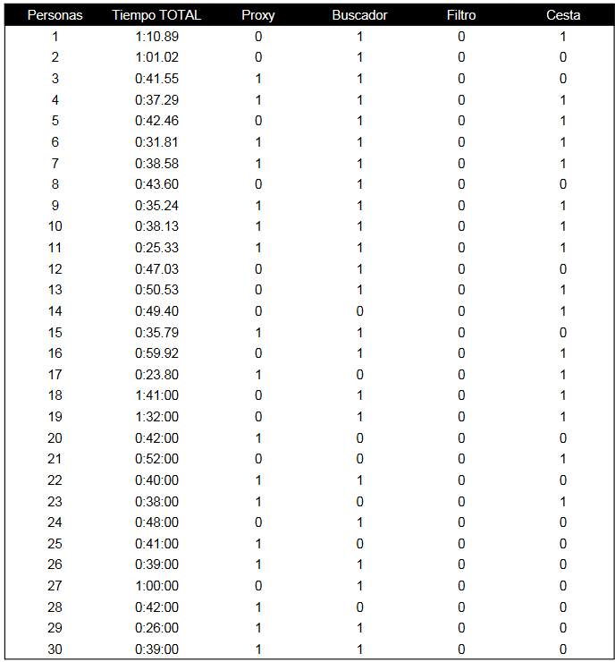
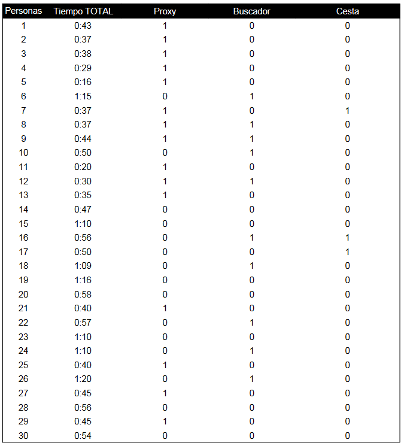
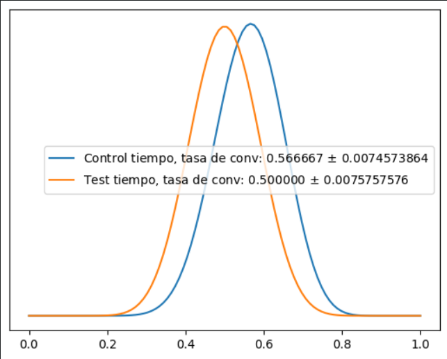
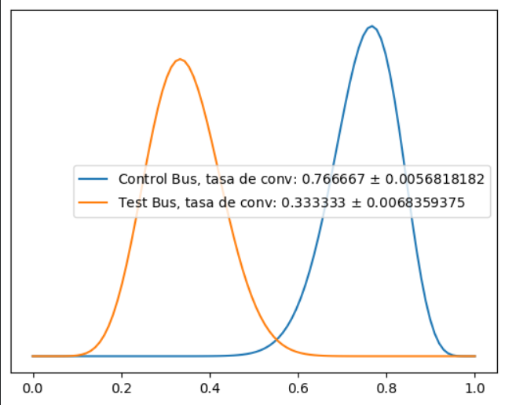
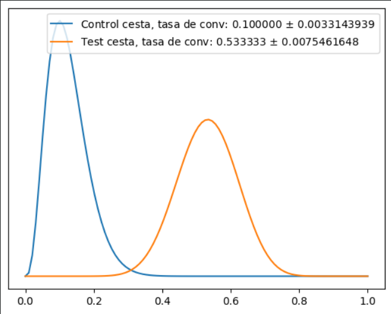

# Proyecto Igualdad
---

En este proyecto hemos trabajado conjuntamente con el equipo de UX para analizar que diseño de una página web era el que más converión tenía.

La página web en cuenstión era una librería feminista y nuestro objetivo era analizar cuanto tiempo tardaba un cliente en realizar una compra dado un libro a comprar, para posteriormente realizar cambios en la página y ver como afectaban al proceso.  

Para realizarlo medimos diferentes factores.  

1. Tiempo desde que entraba en la página hasta que finalizaba la compra  
2. Si usaba o no usaba la barra de buscador  
3. Si una vez que encontraba el libro usaba la pestaña de "Añadir a la cesta" o la de "comprar ya"  

El tiempo lo medíamos en términos horarios (min:seg) y el resto de bariables en términos binarios(1 si lo usaba o 0 si no lo usaba)  

Con estas condiciones obtvimos los siguientes datos:  

  

Una vez tubimos los datos, relizamos el primer análisis, obteniendo los siguientes resultados:

[Análisis](./doc/Presentación_Data.ipynb)  

1. Análisis de tiempo:
    a.Sobre la media(que es 0:42 seg), tenemos 17 que convierten antes de la media y 13 que tardan más de la media en convertir.
    b. Nuestra tasa de conversión es de 56% --> El 56% de los sujetos que realizarn la compra tardaron menos que la media.

2. Análisis de buscador:
    a.Nuestra tasa de uso de buscador es del 76%  -->  El 76% de las personas usó el buscador

3. Análisis de cesta:
    a.Nuestra tasa de uso de cesta es del 53%  -->  El 53% de las peersonas usó la cesta frente al "comprar ya"

Una vez obtuvimos estos datos, el siguiente paso era realizar los cambios en la página y volver a salir a realizar test a otras personas diferentes para no contaminar la muestra.

Después de hacerlo obtuvimos los siguientes datos:

  

Una vez tubimos los datos, relizamos el segundo análisis, obteniendo los siguientes resultados:

1. Análisis de tiempo:
    a.Sobre la media(que es 0:46 seg), tenemos 15 que convierten antes de la media y 15 que tardan más de la media en convertir.
    b. Nuestra tasa de conversión es de 50% --> El 50% de los sujetos que realizarn la compra tardaron menos que la media.

2. Análisis de buscador:
    a.Nuestra tasa de uso de buscador es del 33%  -->  El 33% de las personas usó el buscador

3. Análisis de cesta:
    a.Nuestra tasa de uso de cesta es del 10%  -->  El 10% de las peersonas usó la cesta frente al "comprar ya"

Posteriormente hicimos un análisis de confianza obteniendo las siguientes conclusiones:

### Conclusiones:
---

1. **Con los cambios realizados en el test b, se reduce el tiempo en un 11% con una probabilidad del 69.44%**    
2. **Con los cambios realizados en el test b, se reduce el numero de veces que usan el buscador en un 54% con una probabilidad del 99.96%**    
3. **Con los cambios realizados en el test b, se reduce el numero de veces que usan el buscador en un 76% con una probabilidad del 99.98%**    
  
De igual manera, para reforzar el análisis, relizamos los siguientes gráficos:
  
### Tiempo
---
  
### Buscador  
---
  
### Cesta  
---
  

